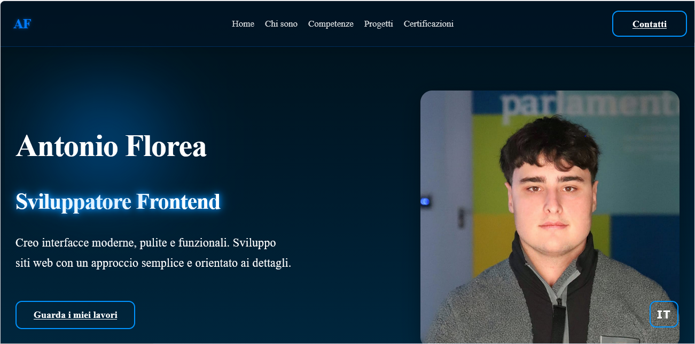

# Portfolio – Antonio Florea 
Benvenuto nel repository del mio Portfolio Personale, un sito moderno e animato sviluppato per presentare le mie competenze, i miei progetti e il mio percorso come Sviluppatore Frontend.Il portfolio è stato progettato con un approccio minimal, pulito e orientato ai dettagli, con animazioni fluide e un design completamente responsive.

## Live Demo
Sito online: (antonioflorea.vercel.app)  

## Screenshot

## Funzionalità
- Animazioni fluide con Framer Motion
- Effetto parallax nella Hero
- Toggle lingua (IT/EN)
- Navbar responsive con menu mobile
- Sezioni animate con Fade-in on scroll
- Layout completamente responsive
- Design moderno, pulito e professionale
- Ottimizzato per performance e UX

##  Tecnologie utilizzate
- React
- Vite
- Framer Motion (animazioni)
- CSS3 (custom, responsive)
- JavaScript ES6+
- i18n personalizzato (toggle lingua IT/EN)
- Vercel (deploy)

##  Installazzione e utilizzo
1)  Clona la repository
   
git clone https://github.com/Anto037/Portfolio.git

2) Entra nella cartella del progetto
   
   cd Portfolio

3)  Installa le dipendenze

   npm install

4) Avvia il server di sviluppo

   npm run dev

##  Struttura del progetto
Portfolio/
│
├── public/
├── src/
│   ├── assets/        # Immagini e icone
│   ├── components/    # Componenti React
│   ├── i18n/          # Traduzioni IT/EN
│   ├── styles.css     # Stili globali
│   ├── App.jsx
│   └── main.jsx
│
└── package.json

##  Contatti
Hai un progetto o vuoi collaborare?

    - Email: antonioflorea39@gmail.com

    LinkedIn: www.linkedin.com/in/antonio-florea-b2b611292

    GitHub: https://github.com/Anto037

##  Autore
Antonio  Florea - 
Studente Web Developer – Verona, Italia

##  Licenza
Questo progetto è distribuito sotto licenza MIT.
